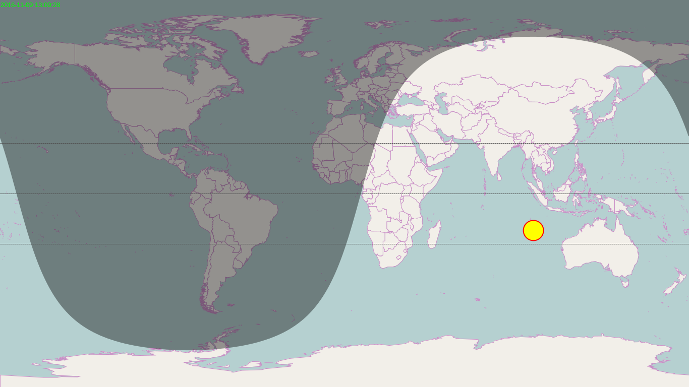

# twilight
A tool for generating wallpaper, including the following steps:

1. Get the resolution and set as the size of wallpaper.

2. Read a world map(shapefile or jpg), set it as the background.

3. Calculate current sun position and twilightline , draw them on the world map.

4. Calculate moon position and draw it.

5. The final output is a png file, which shows the current positions of sun and moon. 

It can be used in the bash file:
```bash
mono ~/twilight.exe -d -o ~/screen.png >>~/log
```

Here is a sample output:

